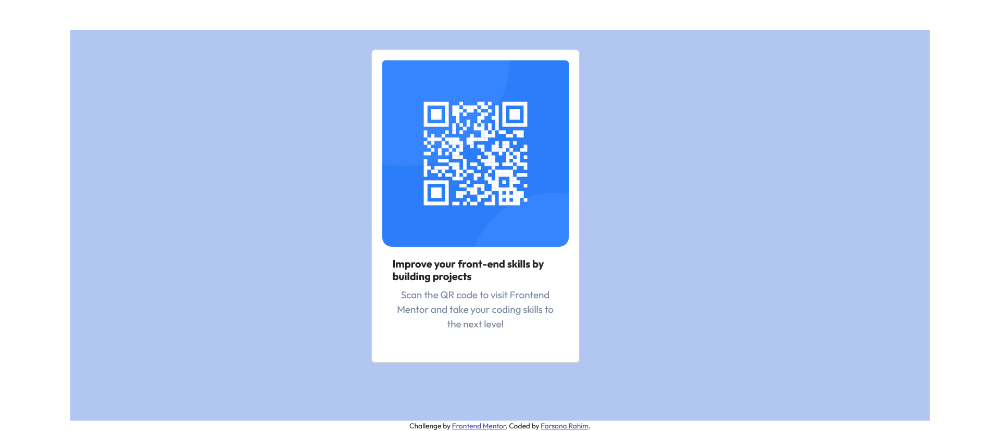

# Frontend Mentor - QR code component solution

This is a solution to the [QR code component challenge on Frontend Mentor](https://www.frontendmentor.io/challenges/qr-code-component-iux_sIO_H). Frontend Mentor challenges help you improve your coding skills by building realistic projects. 

## Table of contents

- [Overview](#overview)
  - [Screenshot](#screenshot)
  - [Links](#links)
- [My process](#my-process)
  - [Built with](#built-with)
  - [What I learned](#what-i-learned)
  - [Continued development](#continued-development)
  - [Useful resources](#useful-resources)
- [Author](#author)
- [Acknowledgments](#acknowledgments)

**Note: Delete this note and update the table of contents based on what sections you keep.**

## Overview

This is my first challenge from FrontEnd Mentor.
### Screenshot

### Links

- Solution URL: [Add solution URL here](https://your-solution-url.com)
- Live Site URL: [Add live site URL here](https://your-live-site-url.com)

## My process

### Built with

- Semantic HTML5 markup
- CSS custom properties
- CSS Layout
- Media Query
- [Bootstrap](https://getbootstrap.com/) - CSS Framework

### What I learned

From this challenge I Learned 
1. how to add an icon to page title.
2. refreshed my knowledge on CSS layout.

### Continued development

I need to improve on CSS layout, grid and flexbox. Looking forward for more challenges from Frontend Mentor

### Useful resources

- I am attending an offline class at Luminar Technolab, Kochi (Kerala, India). I have referred to the examples on CSS layout provided by our trainer.

## Author

- Portfolio - [Farsana Rahim](https://farsana-fr.github.io/portfolio/)
- Frontend Mentor - [@farsana-fr](https://www.frontendmentor.io/profile/farsana-fre)
- LinkedIn - [Farsana Rahim](https://www.linkedin.com/in/farsana-rahim/)

## Acknowledgments

I am grateful to my mentor and the whole crew at Luminar Technolab. I have got a good exposure to CSS and Bootstrap from here.
A special thanks to [Kaela Nguyen](https://www.linkedin.com/in/kdtnguyen/) who have shared her work from Frontend Mentor, that is how I came across this wonderful platform.